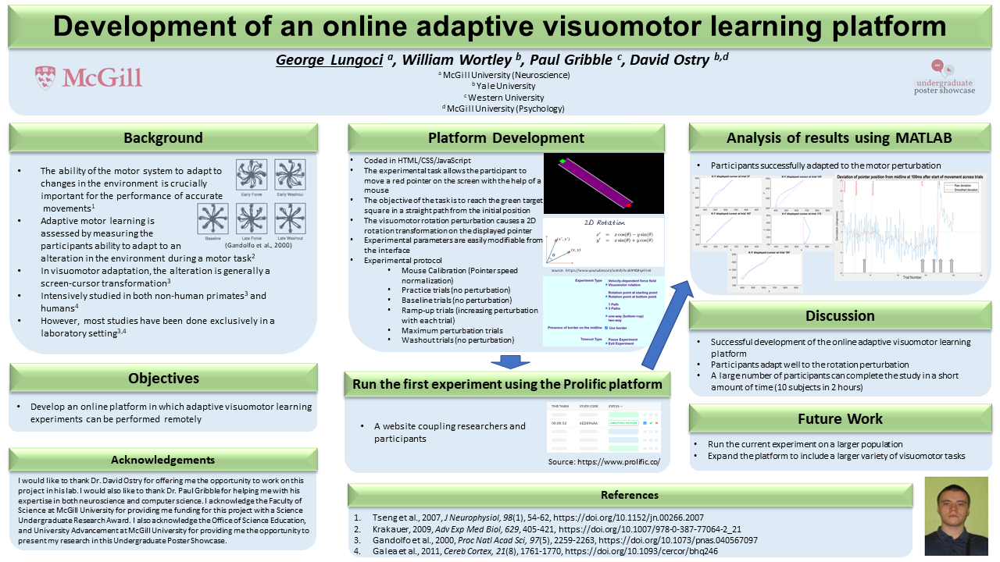

# Pointer-Project

A project done during the Summer of 2020 in Dr. David Ostry's lab. Its purpose was to find an alternative way to perform motor studies during the COVID-19 pandemic when participants could not come to the lab.

The project is an online platform used to perform a variety of motor studies using a computer mouse. It is easy to set the different parameters for the study and all data can be saved on a server to be further analyzed. 

For more details, check the poster presentation below:

## Technologies used:

* MATLAB
* JavaScript
* HTML
* CSS
* PHP
